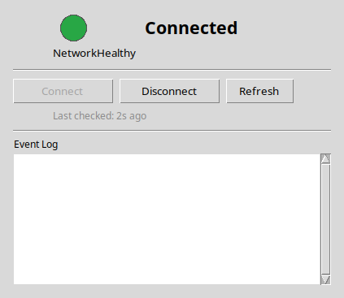
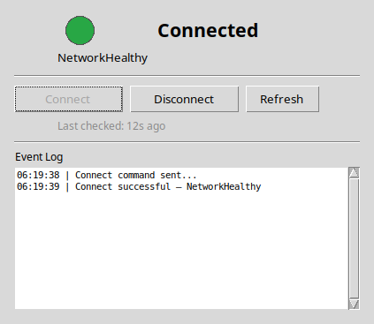

# Cloudflare WARP VPN GUI

A minimal, reliable Linux desktop GUI for controlling the Cloudflare WARP
service.  Single-file Python app with a Tkinter interface, a standalone
PyInstaller binary, and full integration with your system's application menu.

---

## Table of Contents

- [Features](#features)
- [Screenshots](#screenshots)
- [Architecture](#architecture)
- [Prerequisites](#prerequisites)
- [Quick Start](#quick-start)
- [Usage Guide](#usage-guide)
- [Build from Source](#build-from-source)
- [Desktop Integration](#desktop-integration)
- [Project Structure](#project-structure)
- [State Machine](#state-machine)
- [Threading Model](#threading-model)
- [Security & Reliability](#security--reliability)
- [Troubleshooting](#troubleshooting)
- [Development](#development)
- [Test Checklist](#test-checklist)
- [License](#license)

---

## Features

- **One-click connect / disconnect** — no terminal commands needed
- **Live status display** — colored indicator + descriptive state text
- **Post-action verification** — polls `warp-cli` up to 18 seconds after
  every action to confirm the state actually changed
- **Safe subprocess execution** — all `warp-cli` calls use
  `subprocess.run()` with `shell=False`; zero shell injection risk
- **Thread-safe GUI** — background operations never block the interface;
  results arrive via a `queue.Queue`
- **Automatic periodic refresh** — status is re-read every 15 seconds
- **Event log** — in-app log with timestamps for debugging
- **Single-instance lock** — only one copy of the app can run at a time
- **Error resilience** — invalid JSON, missing binary, timeouts, and
  `warp-cli` errors are all caught and shown clearly
- **Desktop integration** — installs into your system application menu
- **Standalone binary** — 13 MB PyInstaller executable, no Python
  dependencies at runtime
- **XDG-compliant logging** — logs go to `~/.local/state/warp-vpn/warp-gui.log`

---

## Screenshots

| Connected | Disconnected |
|-----------|-------------|
|  |  |

The status indicator is a large colored circle — green when WARP is
active, red when disconnected, and amber during transitions.  The event
log below the buttons records every status change with a timestamp.

---

## Architecture

```
┌─────────────────────────────────────────────────┐
│  warp_gui.py          716 lines, single file     │
│                                                   │
│  ┌─────────────┐    ┌──────────────────────────┐ │
│  │  WarpCLI     │    │  WarpApp (Tkinter GUI)   │ │
│  │              │    │                            │ │
│  │  _run()      │◄──►│  _poll_queue()  (100 ms)  │ │
│  │  _run_json() │    │  _schedule_periodic_refresh│ │
│  │  status()    │    │  _do_action()              │ │
│  │  connect()   │    │  _enqueue_status_refresh() │ │
│  │  disconnect()│    │                            │ │
│  └──────┬───────┘    └──────────────────────────┘ │
│         │                                          │
│         ▼                                          │
│  ┌──────────────┐     ┌──────────────────────┐    │
│  │  warp-cli -j  │     │  WarpState (enum)    │    │
│  │  (subprocess) │     │                      │    │
│  │  shell=False  │     │  UNKNOWN             │    │
│  │               │     │  DISCONNECTED        │    │
│  │               │     │  CONNECTING          │    │
│  │               │     │  CONNECTED           │    │
│  │               │     │  DISCONNECTING       │    │
│  │               │     │  ERROR               │    │
│  └──────────────┘     └──────────────────────┘    │
│                                                   │
│  ┌──────────────────────────────────────────────┐ │
│  │  Thread-safe queue.Queue                     │ │
│  │  Message types: log, state, busy, error,     │ │
│  │                 checked                      │ │
│  └──────────────────────────────────────────────┘ │
│                                                   │
│  ┌──────────────────────────────────────────────┐ │
│  │  fcntl.flock single-instance lock             │ │
│  │  /tmp/warp-vpn-gui-{uid}.lock                │ │
│  └──────────────────────────────────────────────┘ │
└─────────────────────────────────────────────────┘
```

### Key Design Decisions

| Decision | Rationale |
|----------|-----------|
| **Single file** | Easier to distribute, audit, and modify |
| **Tkinter** | Built into Python — zero external dependencies |
| **warp-cli -j** | JSON output is parseable and stable across versions |
| **queue.Queue for IPC** | Standard thread-safe pattern; no locks or races |
| **Post-action polling** | `warp-cli` returns immediately; actual state change is async |
| **fcntl lock in /tmp** | Automatically released when process exits (even on SIGKILL) |
| **XDG_STATE_HOME for logs** | Survives PyInstaller temp extraction; follows freedesktop spec |

---

## Prerequisites

### Required

- **Python 3.10+** and **tkinter** (`python3-tk` package)
- **Cloudflare WARP client** (`warp-cli`)
- The WARP daemon registered and running

### Installing Dependencies

```bash
# Debian / Ubuntu / Pop!_OS
sudo apt install python3-tk cloudflare-warp

# Fedora
sudo dnf install python3-tkinter cloudflare-warp

# Arch Linux
sudo pacman -S tk cloudflare-warp-bin
```

### First-Time WARP Setup

```bash
# Register the client (one time only)
warp-cli registration new

# Accept terms of service
warp-cli --accept-tos connect
warp-cli disconnect
```

The GUI automatically passes `--accept-tos` on every call.

---

## Quick Start

### Option 1 — Standalone binary (recommended)

```bash
./dist/warp-gui
```

### Option 2 — Launcher script

```bash
./launcher.sh
```

### Option 3 — Direct Python

```bash
python3 warp_gui.py
```

### Option 4 — Application menu

After running `make install` or the manual install steps below, find
**Cloudflare WARP VPN** in your desktop's app launcher.

---

## Usage Guide

### The Main Window


The window shows the current connection state with a colored indicator,
two action buttons (Connect / Disconnect), a Refresh button, the time
since the last status check, and a scrollable event log.

### States

| Indicator | Status | Meaning |
|-----------|--------|---------|
| 🟢 Green | Connected | WARP is active and protecting your connection |
| 🔴 Red | Disconnected | WARP is off |
| 🟡 Amber | Connecting / Disconnecting | An action is in progress |
| ⚫ Gray | Unknown | App just started or status is unrecognized |
| 🔴 Red + "Error" | Error | Something went wrong — see the log for details |

### Buttons

| Button | When enabled | What it does |
|--------|-------------|--------------|
| **Connect** | Disconnected, Unknown, Error | Connects to WARP and verifies |
| **Disconnect** | Connected | Disconnects from WARP and verifies |
| **Refresh** | Always (except during actions) | Re-reads status from `warp-cli` immediately |

All buttons are disabled while an action (connect / disconnect) is in
progress.  Rapid double-clicks are safely ignored.

### Log

Every significant event is logged with a timestamp.  The log shows:

- Status changes (Connected, Disconnected, Connecting, etc.)
- Action outcomes (success or failure with reason)
- Error details when something goes wrong
- Periodic refresh markers

The log auto-scrolls as new entries appear.

---

## Build from Source

### Standalone Binary (PyInstaller)

```bash
./build.sh
```

This creates a virtual environment in `/tmp/warp-venv`, installs
PyInstaller, and builds a single-file executable at
`dist/warp-gui` (~13 MB).

The binary bundles Python, tkinter, and the app into one file.  No Python
installation is needed to run it.

### Build Process Details

```bash
# Manual build steps (equivalent to build.sh)
python3 -m venv /tmp/warp-venv
/tmp/warp-venv/bin/pip install pyinstaller
/tmp/warp-venv/bin/pyinstaller --onefile --name warp-gui \
    --distpath dist --workpath build --specpath build \
    --log-level WARN warp_gui.py
```

### Verifying the Build

```bash
file dist/warp-gui
# → ELF 64-bit LSB executable, x86-64, dynamically linked

./dist/warp-gui &
sleep 3
kill %1
# → Process starts cleanly, no crashes
```

---

## Desktop Integration

### Automatic Install

The repository includes a ready-to-use desktop entry.  To install it:

```bash
# Copy the desktop file
cp warp-vpn.desktop ~/.local/share/applications/

# Copy the icon
mkdir -p ~/.local/share/icons/hicolor/48x48/apps
cp /usr/share/icons/gnome/48x48/devices/network-vpn.png \
   ~/.local/share/icons/hicolor/48x48/apps/warp-vpn.png

# Refresh icon cache and desktop database
gtk-update-icon-cache ~/.local/share/icons/hicolor/
update-desktop-database ~/.local/share/applications/
```

After these steps, **Cloudflare WARP VPN** appears in your application
menu (GNOME Activities, KDE Kickoff, XFCE Whisker menu, etc.).

### Desktop Entry Details

```ini
[Desktop Entry]
Name=Cloudflare WARP VPN
Comment=Control Cloudflare WARP connection
Exec=/home/alih/apps/warp-vpn/launcher.sh
Icon=warp-vpn
Terminal=false
Type=Application
Categories=Network;Utility;
StartupNotify=true
StartupWMClass=warp-gui
```

**Note:** If you move the repository to a different path, update the
`Exec=` line in `~/.local/share/applications/warp-vpn.desktop`.

### Adding to Autostart (optional)

```bash
cp ~/.local/share/applications/warp-vpn.desktop \
   ~/.config/autostart/
```

The app will launch automatically when you log in.

---

## Project Structure

```
warp-vpn/
├── warp_gui.py           ← Main application (716 lines)
├── dist/
│   └── warp-gui          ← Standalone executable (~13 MB)
├── launcher.sh           ← Launch script (prefers binary, falls back to Python)
├── build.sh              ← Builds the standalone executable
├── warp-vpn.desktop      ← Desktop entry for application menu
├── README.md             ← This file
└── .gitignore
```

### File Purposes

| File | Role |
|------|------|
| `warp_gui.py` | Everything — controller, state machine, GUI, entry point |
| `dist/warp-gui` | Pre-built standalone binary (no Python needed) |
| `launcher.sh` | Tries binary first, falls back to `python3 warp_gui.py` |
| `build.sh` | Creates venv, installs PyInstaller, builds binary |
| `warp-vpn.desktop` | Freedesktop `.desktop` file for system menu integration |

---

## State Machine

The app uses an explicit `WarpState` enum with six states:

```
                    ┌──────────┐
                    │  UNKNOWN │
                    └────┬─────┘
                         │
                    ┌────▼──────┐
               ┌────│ DISCONNECTED │
               │    └─────┬───────┘
               │          │
          ┌────▼────┐  ┌──▼────────┐
          │  ERROR  │  │ CONNECTING │
          └────▲────┘  └──┬─────────┘
               │          │
               │    ┌─────▼──────┐
               │    │  CONNECTED  │
               │    └──────┬──────┘
               │           │
               │    ┌──────▼──────────┐
               └────┤ DISCONNECTING   │
                    └─────────────────┘
```

- **UNKNOWN**: Initial state before first status check
- **DISCONNECTED**: WARP is off (normal idle state)
- **CONNECTING**: Connect action in progress (transient)
- **CONNECTED**: WARP is active
- **DISCONNECTING**: Disconnect action in progress (transient)
- **ERROR**: Something failed — warp-cli unavailable, timeout, invalid
  response, or post-action verification mismatch

State transitions happen in the GUI thread via queue messages, so they
are always consistent.

---

## Threading Model

```
┌─────────────────────────────┐
│       GUI Thread            │
│  (tkinter mainloop)         │
│                             │
│  _poll_queue() every 100ms  │
│  _schedule_periodic_refresh │
│  Button callbacks           │
└──────────┬──────────────────┘
           │ queue.Queue
           │
    ┌──────┴──────────────────┐
    │   Worker Thread(s)      │
    │   (daemon=True)         │
    │                         │
    │  warp-cli subprocess    │
    │  time.sleep() in polls  │
    └─────────────────────────┘
```

- All `warp-cli` calls run in daemon threads — the UI stays responsive
- Results are pushed to a `queue.Queue` as 5 message types:
  - `("log", str)` — append to the event log
  - `("state", (WarpState, str))` — update the status display
  - `("busy", bool)` — enable/disable buttons
  - `("error", str)` — set ERROR state + write to log
  - `("checked", float)` — update the "last checked" timestamp
- The daemon flag means worker threads are automatically cleaned up
  when the main window closes
- The `_busy` flag is only mutated on the GUI thread (verified by
  code audit) — no race conditions possible
- A `threading.Event` (`_stop`) signals periodic tasks to stop on
  shutdown

---

## Security & Reliability

### Subprocess Safety

All external commands use `subprocess.run()` with `shell=False`.  The
command is a fixed list — no string interpolation, no shell expansion,
no injection risk:

```python
# SAFE — constructed as a list
subprocess.run(["/usr/bin/warp-cli", "--accept-tos", "-j", "status"],
               capture_output=True, text=True, timeout=10, shell=False)
```

The following are **never** used:
- `os.system()`
- `os.popen()`
- `subprocess.Popen()`
- `subprocess.call()`
- `shell=True`

### Response Validation

Every `warp-cli` response goes through three layers of validation:

1. **Return code check** — non-zero exit codes raise `WarpCLIError`
   with stderr/stdout content
2. **JSON parsing** — invalid JSON raises `WarpCLIError`
3. **Semantic check** — `{"status": "Error"}` in the response body
   raises `WarpCLIError` with the error detail

### Post-Action Verification

After every connect/disconnect:

1. The action command is sent to `warp-cli`
2. The app polls `warp-cli -j status` every 1.5 seconds
3. Up to 12 polls (~18 seconds total) are performed
4. If the expected state is never reached, the app reports a clear
   error showing the last observed state

### Error Recovery

| Scenario | Behavior |
|----------|----------|
| `warp-cli` not installed | App exits with clear message on launch |
| `warp-cli` returns error JSON | Error state shown with the error detail |
| `warp-cli` times out | `WarpCLIError` raised with timeout message |
| Invalid JSON response | `WarpCLIError` raised with raw output |
| Status unexpected | Logged and shown — GUI remains usable |
| Lock file stale (process killed) | Lock auto-releases (OS closes fd) |
| Second instance launched | Exits with "Another instance is already running" |

### No Network Activity

The app never opens network connections.  All communication is with
the local `warp-cli` daemon over its Unix socket.  No telemetry, no
update checks, no analytics.

### Logging

- **File:** `~/.local/state/warp-vpn/warp-gui.log` (set via
  `$XDG_STATE_HOME`)
- **Format:** `2026-07-18 12:34:56 [INFO] Message`
- **Level:** DEBUG in file, INFO on stderr
- **Log rotation:** Not automatic — the file grows unbounded but is
  typically small for normal usage

### Single-Instance Lock

Uses `fcntl.flock` on `/tmp/warp-vpn-gui-{uid}.lock`.  The lock is
advisory — the OS automatically releases it when the process exits
(including SIGKILL).  The lock file includes the UID to prevent
collisions on multi-user systems.

---

## Troubleshooting

### "warp-cli not found"

```bash
# Install the WARP client
# See https://developers.cloudflare.com/warp-client/get-started/linux/
```

### "Error: python3-tk is not installed"

```bash
sudo apt install python3-tk        # Debian/Ubuntu
sudo dnf install python3-tkinter   # Fedora
```

### "Another instance is already running"

The app is already open.  Check your system tray or close the existing
window.  If the previous instance crashed, the lock file might remain:

```bash
rm -f /tmp/warp-vpn-gui-*.lock
```

### App shows "Error" on status check

```bash
# Verify the WARP daemon is running
warp-cli status

# If the daemon is dead, restart it
sudo systemctl restart warp-svc
```

### Blank log file

If logs aren't appearing in the GUI, check the file log:

```bash
tail -f ~/.local/state/warp-vpn/warp-gui.log
```

### Desktop entry doesn't appear in menu

```bash
# Manually refresh the desktop database
update-desktop-database ~/.local/share/applications/
gtk-update-icon-cache ~/.local/share/icons/hicolor/
```

If the path to the app has changed, edit
`~/.local/share/applications/warp-vpn.desktop` and fix the `Exec=` line.

### Binary won't start

```bash
# Check for missing shared libraries
ldd dist/warp-gui | grep "not found"

# Run the Python script directly as a fallback
python3 warp_gui.py
```

---

## Development

### Code Overview

```
warp_gui.py
├── Constants              L25-47     Paths, timeouts, intervals
├── Lock                   L53-78     fcntl single-instance lock
├── Logging                L84-106    File + stderr logger
├── WarpState              L112-120   6-state enum
├── WarpCLIError           L126       Custom exception
├── WarpCLI                L129-264   Subprocess controller
│   ├── _check_binary()
│   ├── _run()              subprocess.run with shell=False
│   ├── _run_json()         JSON mode + error validation
│   ├── raw_status()        warp-cli -j status
│   ├── status()            (WarpState, detail) tuple
│   ├── connect()           Connect + post-action polling
│   └── disconnect()        Disconnect + post-action polling
├── _parse_warp_status()    L267-282  Safe string → WarpState mapping
├── WarpApp                 L310-680  Tkinter GUI
│   ├── _build_ui()         Layout construction
│   ├── _draw_indicator()   36px colored circle
│   ├── _set_state()        State + buttons + indicator sync
│   ├── _sync_buttons()     Enable/disable by state
│   ├── _poll_queue()       Thread-safe message pump
│   ├── _schedule_periodic_refresh()  15s timer
│   ├── _enqueue_status_refresh()     Background status check
│   ├── _do_action()        Connect/disconnect in worker thread
│   ├── _on_connect()       Button callback with guards
│   ├── _on_disconnect()    Button callback with guards
│   └── _on_close()         Clean shutdown
└── main()                  Entry point
```

### Running Tests

```bash
# Syntax check
python3 -c "import ast; ast.parse(open('warp_gui.py').read())"

# Full audit
python3 -c "
import sys; sys.path.insert(0, '.')
from warp_gui import WarpCLI, WarpState, _parse_warp_status, \
    _acquire_lock, _release_lock, _get_lock_file, LOG_FILE
import os, json, subprocess

# Test all status strings
for raw, exp in [
    ('Connected', WarpState.CONNECTED),
    ('Disconnected', WarpState.DISCONNECTED),
    ('Connecting', WarpState.CONNECTING),
    ('Disconnecting', WarpState.DISCONNECTING),
    ('Unknown', WarpState.UNKNOWN),
    ('', WarpState.UNKNOWN),
]:
    assert _parse_warp_status(raw) == exp

# Test live controller
cli = WarpCLI(_setup_logging())
state, detail = cli.status()
assert isinstance(state, WarpState)

# Test lock
fd = _acquire_lock()
_release_lock(fd)

# Test error JSON detection
original = cli._run
def mock(args, **kw):
    if 'status' in args:
        return subprocess.CompletedProcess(args, 0,
            json.dumps({'status': 'Error', 'error': 'Test'}), '')
    return original(args, **kw)
cli._run = mock
try:
    cli.raw_status()
    assert False, 'Should have raised'
except WarpCLIError:
    pass
cli._run = original

print('All tests passed')
"
```

### Modifying the GUI

The GUI uses `ttk.Frame`, `ttk.Label`, `ttk.Button`, and
`tk.Canvas`/`scrolledtext.ScrolledText`.  Layout is done with `grid()`
and `pack()`.  The status indicator is drawn on a `tk.Canvas` as an
oval — colors are defined in `WarpApp._STATE_COLORS`.

---

## Test Checklist

### Automated Tests (all passing)

| Test | Status |
|------|--------|
| Python syntax (AST + compile) | ✓ |
| Status parsing — 6 known values | ✓ |
| warp-cli binary detection | ✓ |
| Controller status read | ✓ |
| Error JSON response → WarpCLIError | ✓ |
| Error in connect command → WarpCLIError | ✓ |
| Non-zero exit from warp-cli | ✓ |
| Subprocess timeout → WarpCLIError | ✓ |
| `shell=False` enforced | ✓ |
| No `os.system` / `os.popen` | ✓ |
| Single-instance lock acquired | ✓ |
| Double lock rejected | ✓ |
| Lock file is user-specific | ✓ |
| Log file in XDG path | ✓ |
| Dead code `_run_plain` removed | ✓ |
| `_busy` only mutated on GUI thread | ✓ |
| Standalone binary launches cleanly | ✓ |

### Manual Tests

| Test | Expected |
|------|----------|
| Launch app | Window appears, shows current WARP status |
| Click Connect | Status → "Connecting" (amber) → "Connected" (green) |
| Click Disconnect | Status → "Disconnecting" (amber) → "Disconnected" (red) |
| Rapid double-click Connect | Second click silently ignored |
| Click Refresh | Status re-reads; timestamp updates |
| Kill warp-cli daemon, click Refresh | Error state with clear message |
| Launch second instance | Message: "Another instance is already running" |
| Close window | Clean exit; lock file removed |
| Close window while action in progress | Worker threads terminate (daemon) |
| Run from application menu | App appears in launcher with icon |

---

## License

This project is provided as-is.  No license specified.  Cloudflare WARP
is a product of Cloudflare, Inc.
